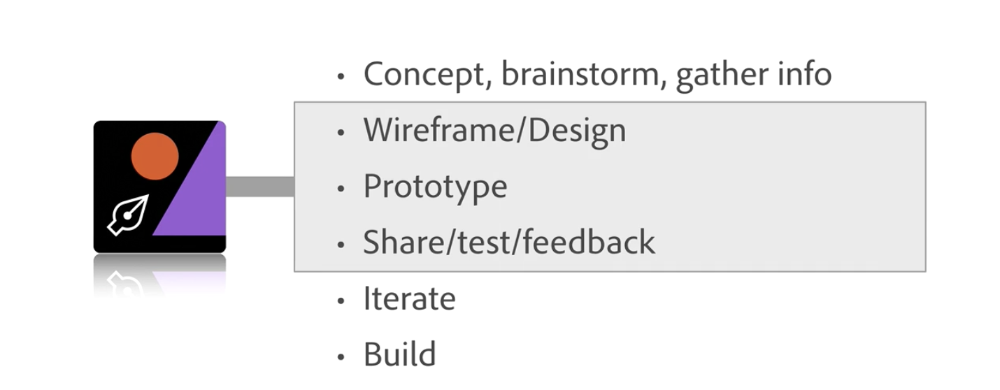

# What is Figma

## Generic UX Design Workflow

It all depends on the scope and size of th project on timeline.

* **(1) Concepting, brainstorm, gather info** - looking at user-base, and the size, the scope of the project determines how much time will be spent on it
* **(2) Wireframe/Design** - some are skipping wireframe these days and going straight to design phase
* **(3) Prototype** - taking the wireframe/design and adding the action to let users try it out
* **(4) Share/test/feedback** - to gather feedback
* **(5) Iterate** - we iterate all over again, like do another design phase, another prototype change, share it, test, feedback
* **(6) Bulid**

## Where does Figma fit in?

With Figma, we do design, prototype, share, get feedback and commenting.

<kbd></kbd>

## Other Tools for Designing, Protoyping and Sharing

* Figma
* Adobe Xd Experience Design
* Sketch (and it's 3rd party plug-ins)
* Invision
* Proto.io
* Marvel App
* ...so many more!

## What Set's Figma Apart?

Figma is an Interface Design tool, UX/UI, web, app, etc.

* **Components** (symbols in other design tools), are the interesting part about Figma, they help you work smarter and faster.

* **Effects** in design like drop down shadows, etc.

* **Frames** are similar to artboards in other design tools, but a little different in Figma. They're useful when you understand how they work.

* **Versioning** you can look at versions within the tool, you can even rollback like how you would with Git version control.

* **Vector Networks** is a different way to draw.

In Figma, we also have the ability to share.

* **Real-time collaboration** where multiple contributors can go into the same file and see each other working.

* **Team Projects**

* **Commenting** the ability to let contributors add comments in place as in you can comment directly to something on the frame.

We can Prototype with Framer integration though. Prototyping is not within Figma, we would have to import Figma content into Framer.

Some people have called Figma the Google Docs of UX Design bc they way it works.