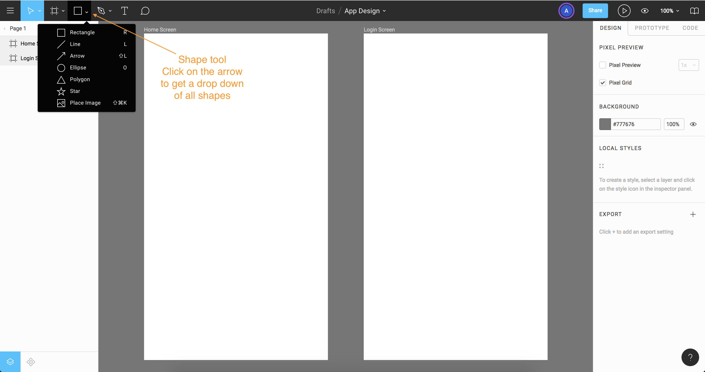
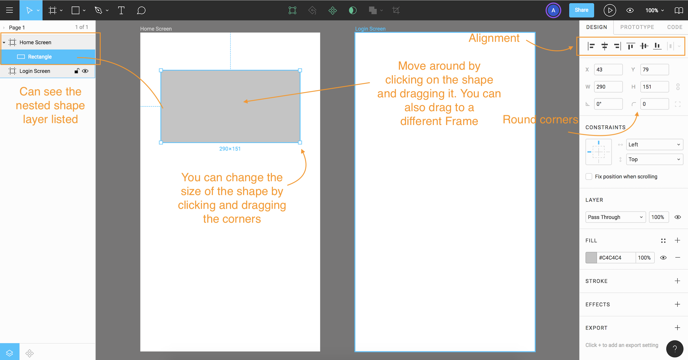
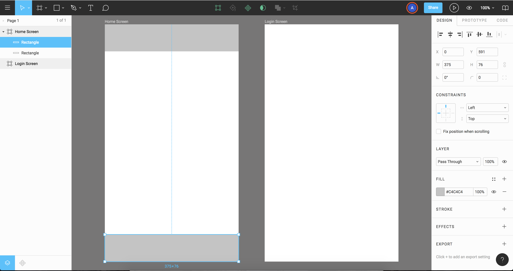
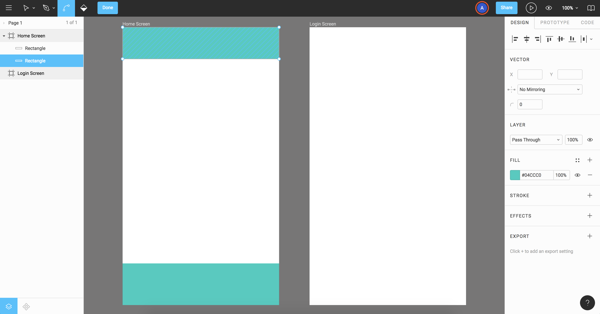
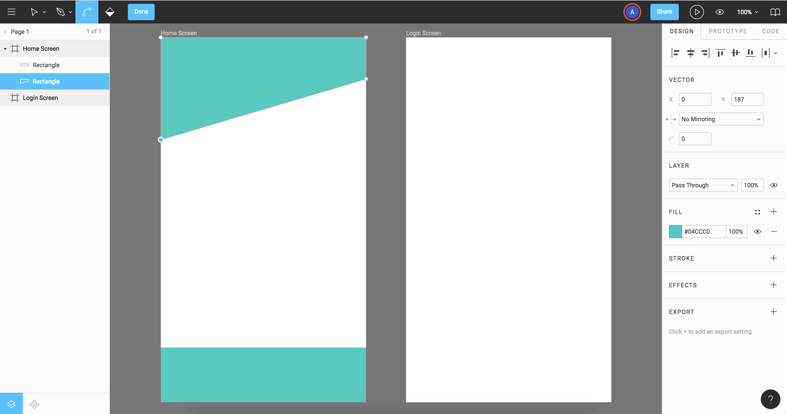
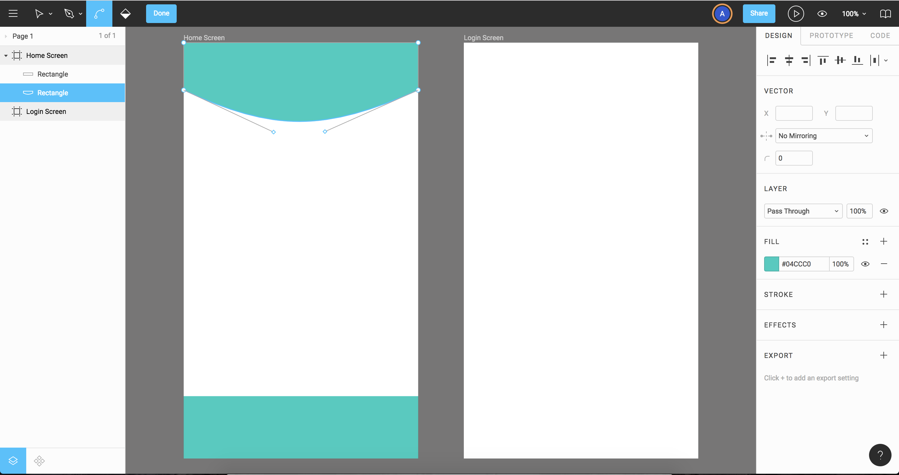

# Creating and Editing Shape Tools

Figma offers a wide range of drawing tools and different ways to do things like bring in Vector content, to Edit content, etc.

<kbd></kbd>

Notice that the shape is nested under the Frame it's placed in. You can resize the shapes by clicking and dragging the edges or on the lines.

For Fill, there's more options to the effects of the shape like solid, linear, etc and even image. You can add multiple Fills to the shape too! 

There's also different was to set colors from RGB, HEX, etc. Use the eye dropper to go out and sample colors.

There's a lot of features in Stroke also, the weight, alignment/position, the three dots give you more options.

<kbd></kbd>

To Duplicate the shape, hold option and drag the shape and let go.

<kbd></kbd>

# Shape Editing Mode

Click on the Shape and hit enter, you'll get into Shape Editing mode.

<kbd></kbd>

Then, you can click on a point on the Shape to reshape it.

<kbd></kbd>

The Pen tools is used to add points or delete points.

The Bend tool, you can click and drag on the point to make a curve shape. It'll also create direction arms which you can adjust.

<kbd></kbd>