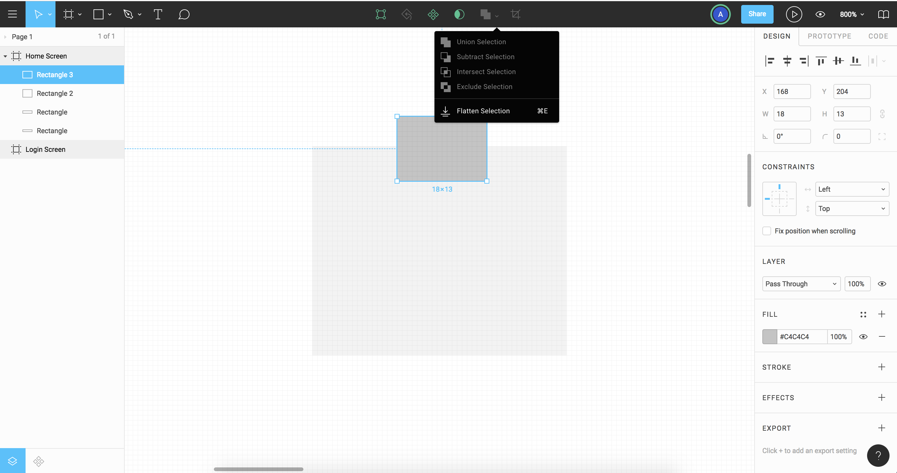
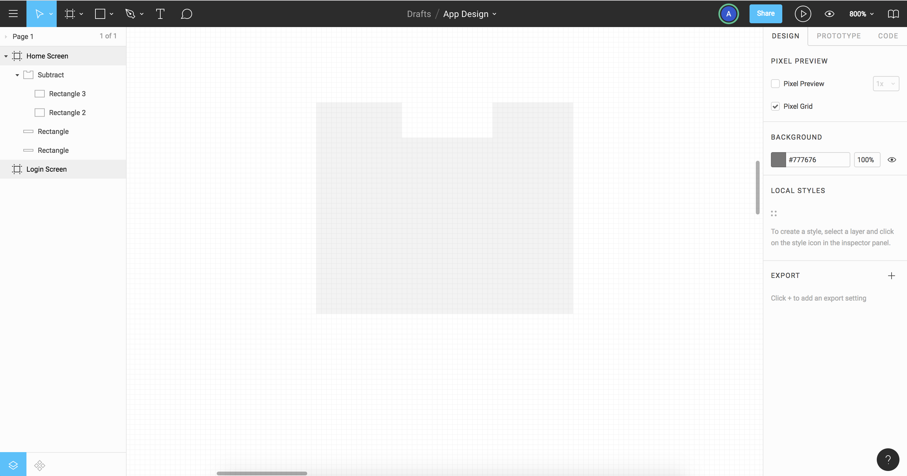
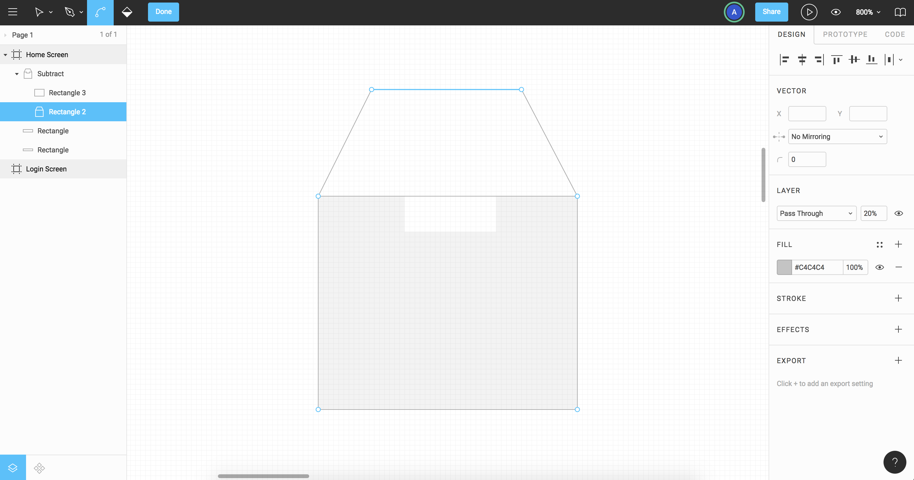
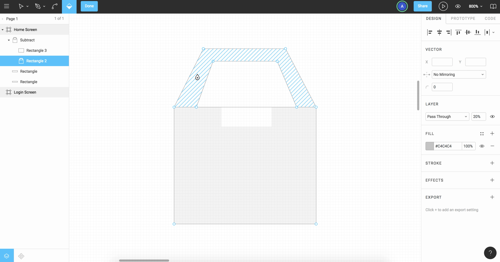
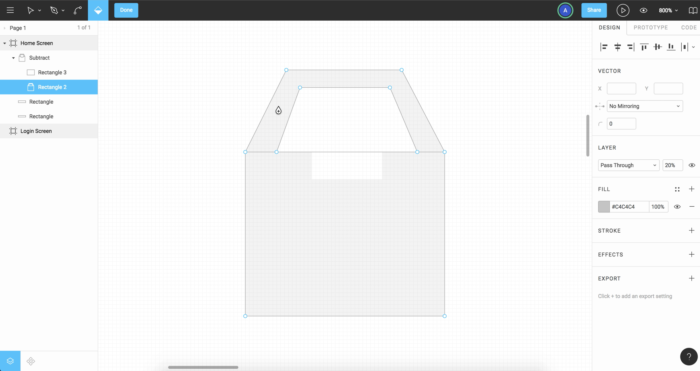
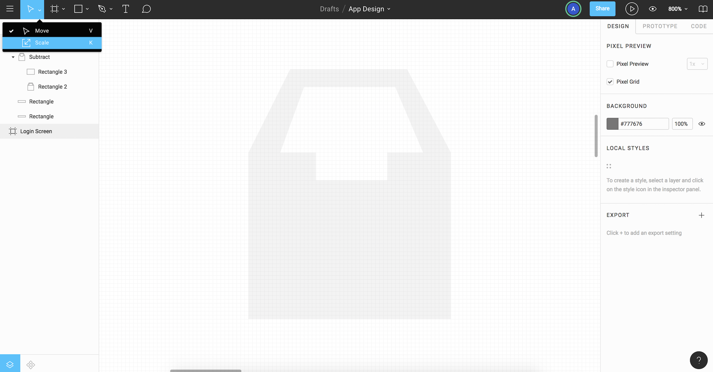
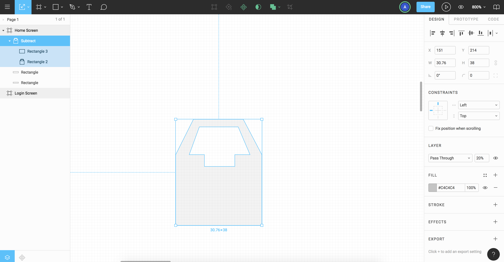
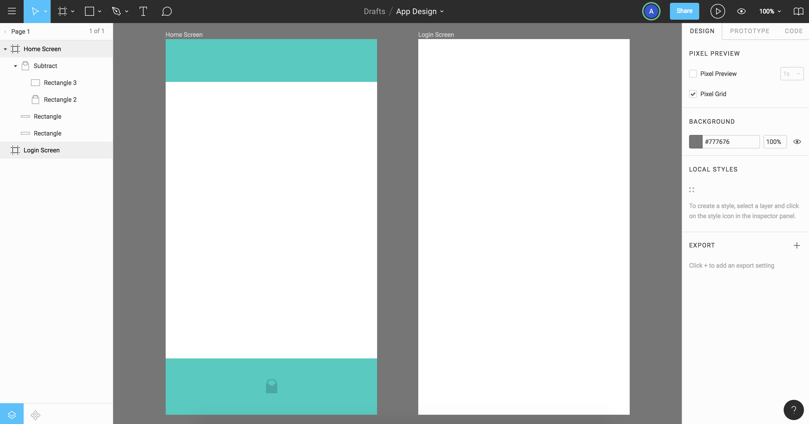
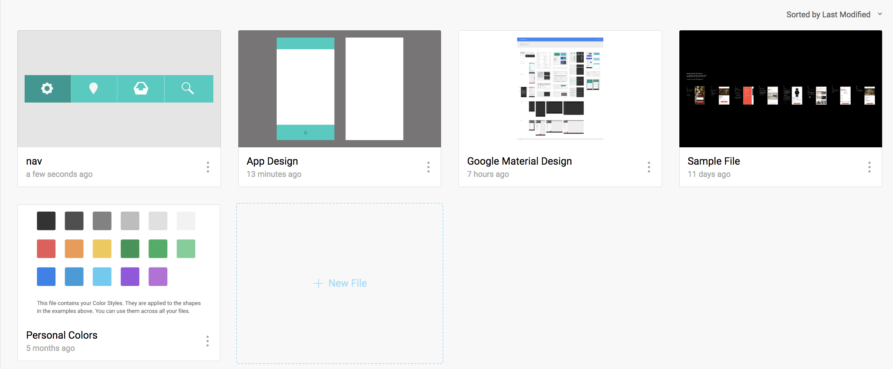
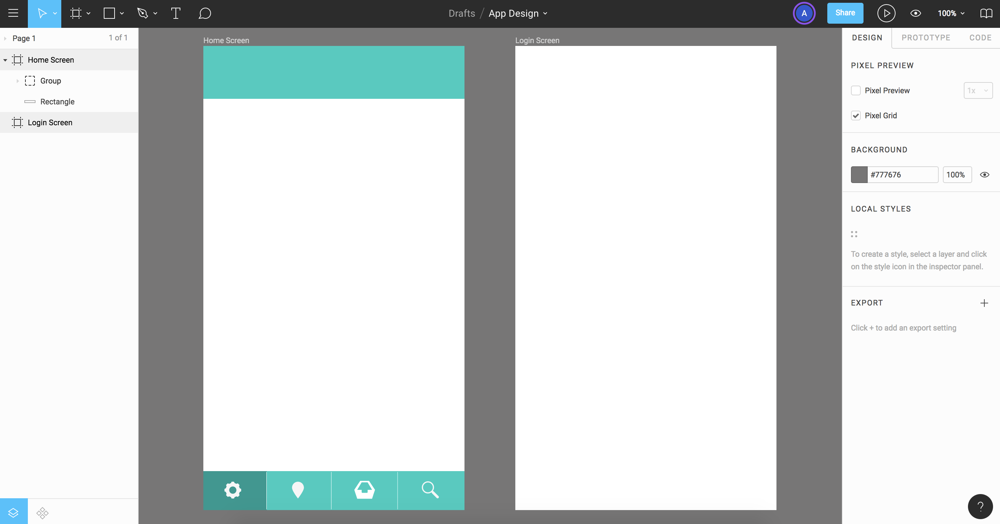

# Drawing

Similar to other Pen tools in other Design software, but it does have some additional features.

# Merging Shapes

Draw a little rectangle shape. Hold ```shift + 2``` to zoom (press ```-``` minus sign to zoom out if needed). 

Draw another rectangle and draw on top. Then align by selecting both via dragging over, and then click on the center align icon on the right panel. Next, take the small shape and punch it out of the big shape.

<kbd></kbd>

Go to the tools at the top, referred to as pathfinders, but are called Boolean Groups. Click where it looks like layerd squares, Subract Selection. It'll shave the top part of the small square off. Go to the left panel and click on the shape, it'll come back and you can stil reshape it, the full shape.

<kbd></kbd>

# Start Adding with Pen Tool

## Vector Network

Double click on the Shape (Rectangle 2) to get into the Shape Editing mode. Next, click on the Pen tool, we're going to continue the path. Click on the left corner, the dot, click to set a point. Keep clicking to set different points to create a shape you want. 

<kbd></kbd>

## Paint Bucket

The half filled diamon icon on the top left is the Paint Bucket tool, you can hover over different areas and you can fill them in.

<kbd></kbd>

<kbd></kbd>

Remember to Click the Done button to get out of Shape Editing mode.

## Scale Shape

Go to the Move tool to Scale the shape, especially if you have strokes on your design, you need to use this. The Scale tool won't distort the shape.

Scale this icon to 20px wide. Press ```shift + 1``` to go back to full screen.

<kbd></kbd>

<kbd></kbd>

Click and drag the icon to whichever location you want.

<kbd></kbd>

## Bringing Other Content into Figma

**Adobe Illustrator**

If using Illustrator, you can copy and paste straight from Illustrator over to Figma.

If you copy and pasted a Text object from Illusttrator, it's going to convert it to image in Figma. 

If you copy and paste Text, it'll still be Text in Figma.

**Sketch**

You need to copy as SVG. On Sketch, go to Edit, Copy SVG Code to get it over to Figma.

## Add Nav File

Import nav file, if you've already designed a nav, open it, click on the nav and copy.

Go into our App Design project and paste it in.

<kbd></kbd>

The nav design will continue to be a group when paste into the Figma file. It's not associating into any Frame yet. Go ahead and delete the old footer rectangle we create.

Take the nav and go to the left panel to bottom align and center. Later on, it's going to be turn into a Nav component so we can reuse in other Frames.

<kbd></kbd>