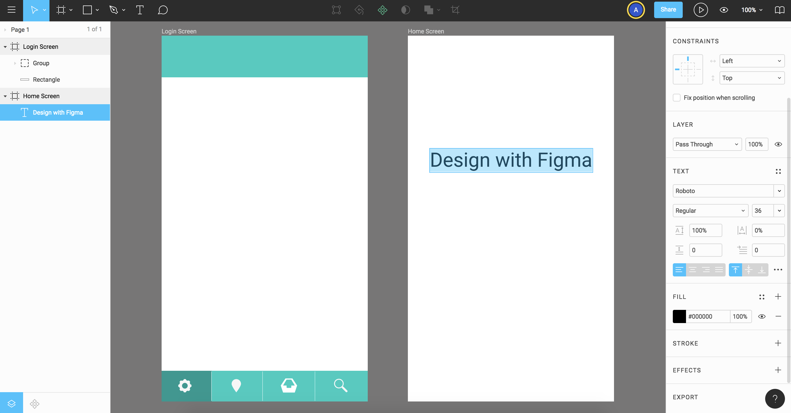
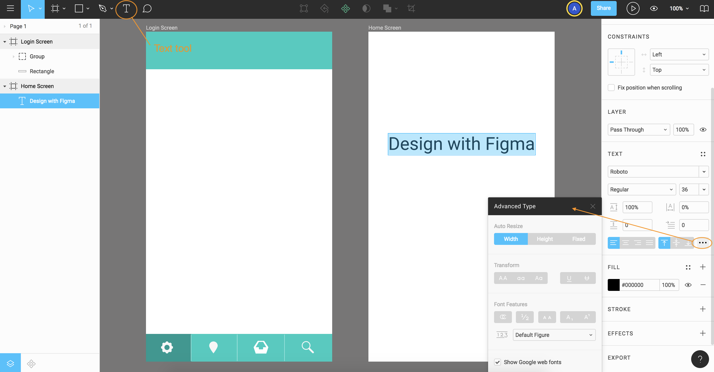
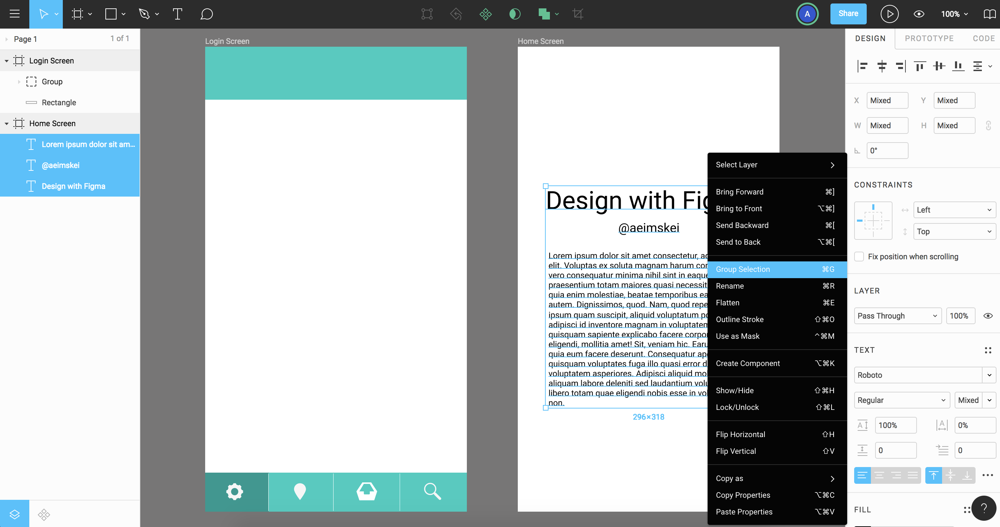

# Adding and Formetting Text

We can copy and paste texts from other applications if we want to, but you can add text using Figma's Text tool too. Click on the T symbol or hit T key on keyboard. There are two ways you can create texts.

* Click and start typing
* Click and drag creating a type area (like a text box)

<kbd></kbd>

When you double click to highlight on the text, you'll notice in the right panel, there a bunch of text formatting options.

## Auto Resize

<kbd></kbd>

Click on the triple dots to get more options with Auto resize. 

* Fixed - when you keep typing, it's going to wrap 
* Height - if you keep typing, it's going to keep going height-wise
* Width

## Fonts

It automatically some with Google Fonts. You can work with your local system fonts too (you need to install to enable, go to Account Settings).

## Group Texts

Highlight all that you want to group, right click and click Group Selection.

<kbd></kbd>