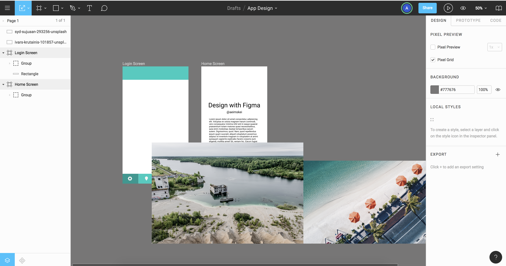
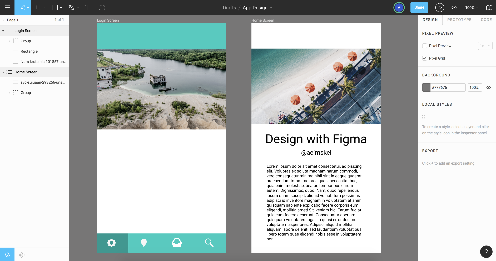
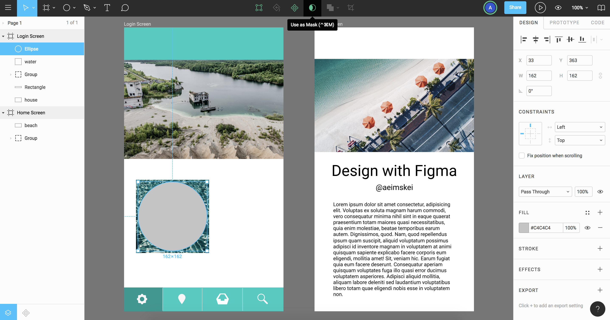
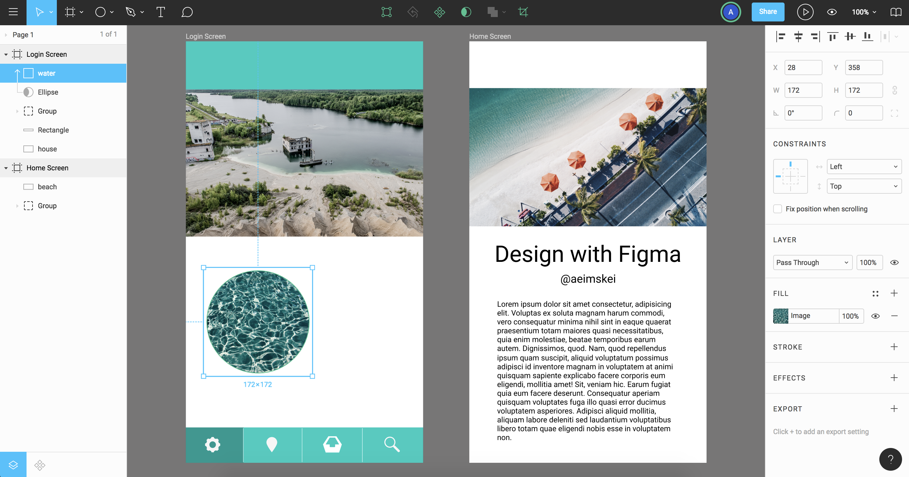

# Images and Masking

In Figma, you can include typical types of images like PNG, JPEG, GIF and SVG at full size and as a background fill.

You can also mask them. With Figma, you can use the Shape tool, create a shape, then go to the right panel click on the Fill options and you can input and image that way too - it'll fill a mask and bring the image in.

Drag and drop in the image files.

<kbd></kbd>

## Scaling and Editing Image

To make those images associate to a Frame, drag and drop into the Frames you want the image to associate to.

Adjust the image size, use the Scale tool to not distort. On the right panel, you can edit the images like color, opacity, ordering etc.

When scaling, you can hold Option, click on corner and it'll scale from center.

<kbd></kbd>

## Masking

Drop in another photo. We're gonna mask, so go to the Shape tool and select Ellipse, click, hold shift and drag to make a perfect circle.

<kbd></kbd>

In the left panel, notice that the Ellipse shape is at the top of the Layers in its Frame. Anything above that object that in the same Frame is going to be masked.

You'll need to drag your image up above the Ellipse.

<kbd></kbd>

Zoom into the Ellipse with ```shift + 2``` and you can move the image around by clicking on the image and moving it around. The Mask can be changed too, click on the Ellipse shape on the left panel and then change.

You can Group it and duplicate it for later use if you want too.
