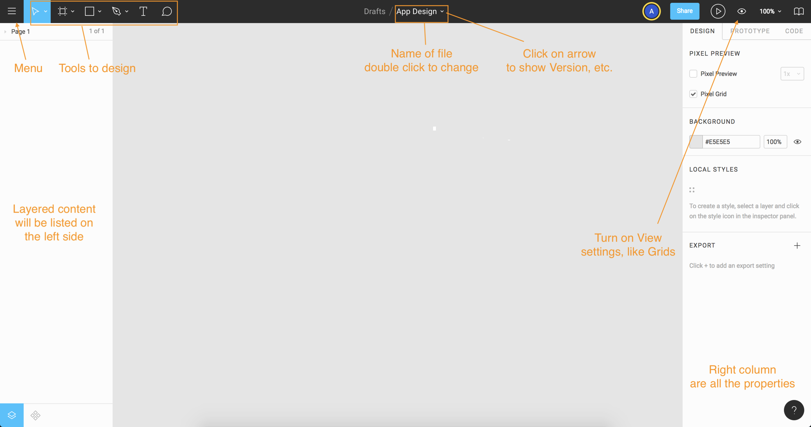
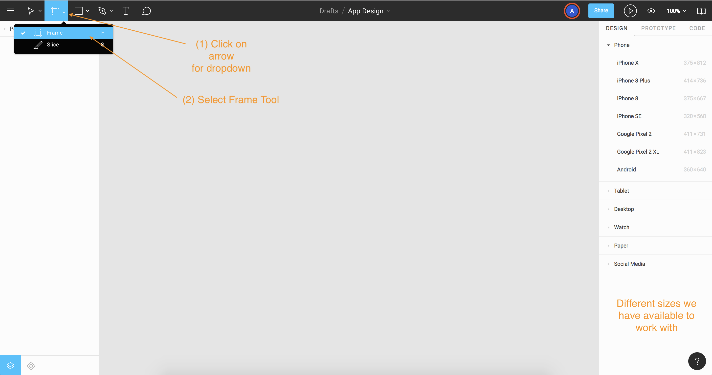
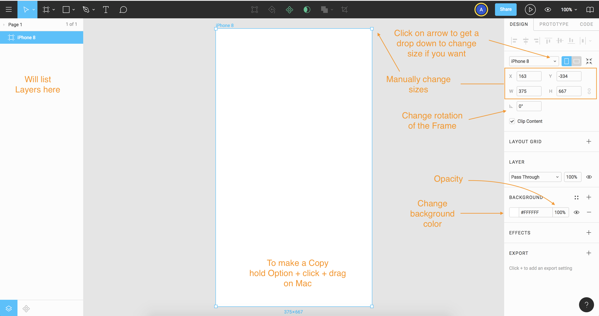
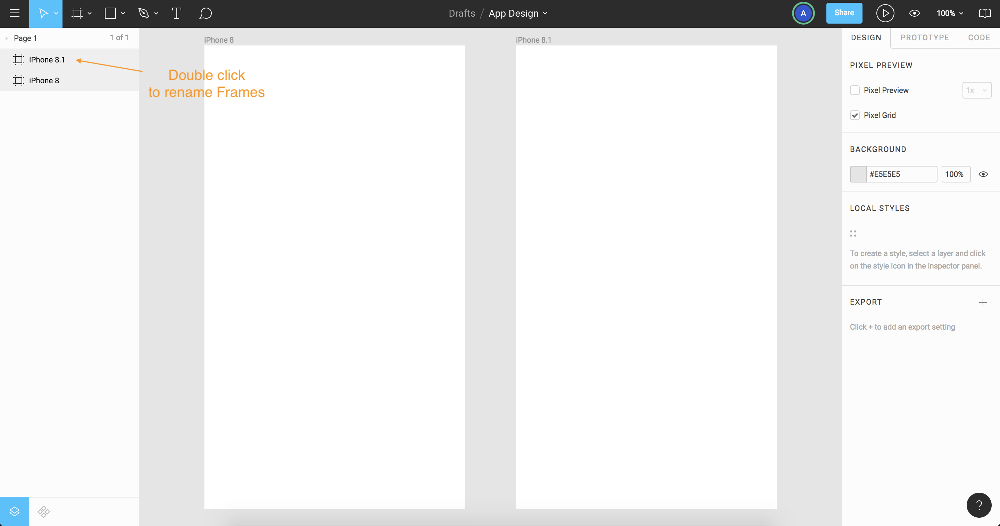
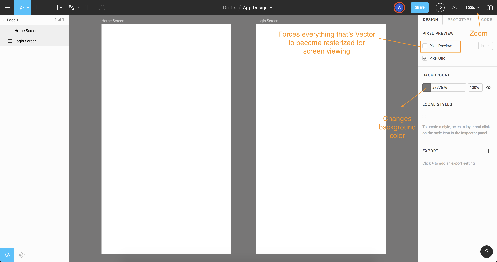

# Adding Content

## Working with Frames

Frames are similar to artboards that are found in Sketch, Adobe Xd or Adobe Illustrator, but they're a little different in Figma.

Think of them as special groups that can be nested in one another.

First create a new file, name whatever you want.

<kbd></kbd>

## Setting up Frames

Going over the layout and how to work Frame view mode.

<kbd></kbd>

Different tools and features when working in Frame.

<kbd></kbd>

Making copies of frame and renaming.

<kbd></kbd>

Playing with workspace settings.

<kbd></kbd>